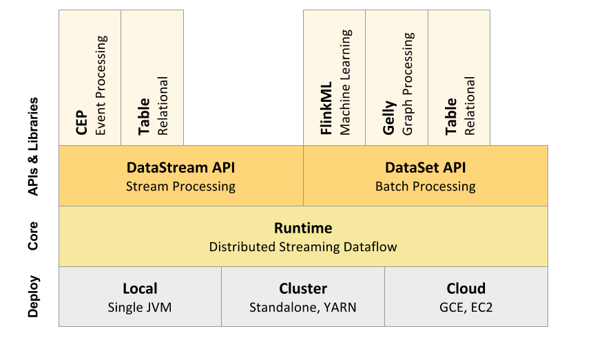
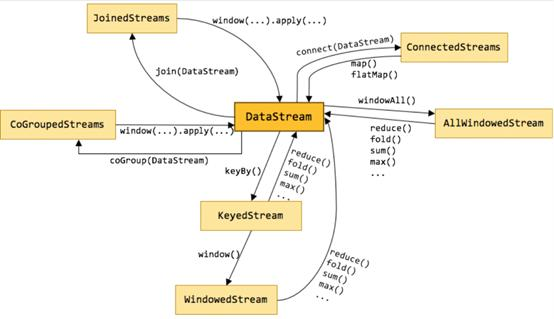
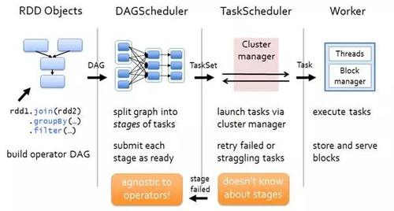

* [9.4、Flink Streaming]()
    - [1）、Flink如何保证数据仅且消费一次？]()
    - [2）、Flink如何做checkPoint检查点？分布式快照原理是啥?]()
    - [3）、Flink程序消费过慢如何解决？]()
    - [4）、统计实时流中某一单词出现的总个数（eg：比如一天某商品被点击的PV）？](bigdata-flink/src/main/scala/com/libin/data/flink/streaming/etl/GenCodeFromState.scala)
    - [5）、Flink中时间有几种？]()
    - [6）、Flink中窗口有几种？]()
    - [7）、Flink中state如何理解？状态机制?]()
    - [8）、Flink中Operator是啥？]()
    - [9）、Flink中StreamExecutionEnvironment初始化流程？]()
    - [10）、用过DataStream里面的哪些方法？]()
    - [11）、Flink程序调优？]()
    - [12）、Flink如何解决数据乱序问题？Watermark使用过么?EventTime+Watermark可否解决数据乱序问题?]()
    - [13）、Flink的checkpoint存储有哪些(状态存储)？]()
    - [14）、Flink如何实现exactly-once？]()
    - [15）、海量key去重,双十一场景,滑动窗口长度为1小时,滑动距离为10s,亿级别用户,如何计算UV？]()
    - [16）、Flink的checkpoint和spark streaming比较？]()
    - [17）、Flink CEP编程中当状态没有达到时候,数据会保存在哪里？]()
    - [18）、3种时间语义？]()
    - [19）、Flink面对高峰数据如何处理？]()
    - [20）、Flink程序运行慢如何优化处理？]()
    - [21）、Flink程序延迟高如何解决？]()
    - [22）、Flink如何做容错？]()
    - [23）、Flink有没有重启策略？说说有哪几种?]()
    - [24）、Flink分布式快照原理是什么?]()
    - [25）、Flink的Kafka连接器有什么特别的地方?]()
    - [26）、Flink的内存管理?]()
    - [27）、Flink序列化都有哪些?怎么实现的?]()
    - [28）、Flink的window出现了数据倾斜,如何解决?]()
    - [29）、Flink在使用聚合函数GroupBy、KeyBy、Distinct等函数出现数据热点如何解决?]()
    - [30）、Flink如何处理反压?和spark streaming和storm区别有了解么?]()
    - [31）、Flink的Operator Chains算子链了解么?]()
    - [32）、Flink什么时候会把Operator Chain在一起行程算子链?]()
    - [33）、Flink1.7特性?Flink1.9特性]()
    - [34）、Flink组件栈有哪些?]()
    - [35）、Flink运行需要依赖哪些组件?必须依赖Hadoop么?]()
    - [36）、Flink基础编程模型?]()
    - [37）、Flink集群有哪些角色?各有什么作用?]()
    - [38）、Flink中Task Slot概念?Slot和parallelism区别?]()
    - [39）、Flink中常用算子有哪些?]()
    - [40）、Flink分区策略?]()
    - [41）、Flink并行度如何设置?]()
    - [42）、Flink分布式缓存用过没?如何使用?]()
    - [43）、Flink广播变量,使用时候需要注意什么?]()
    - [44）、Flink Table&SQL熟悉不?TableEnvironment这个类有什么作用?]()
    - [45）、Flink SQL实现原理是什么?如何实现SQL的解析?]()
    - [46）、Flink如何支持流批一体的?]()
    - [47）、Flink如何支如何做到高效的数据转换?]()
    - [48）、Flink如何做内存管理?]()
    - [49）、Flink Job提交流程?]()
    - [50）、Flink的三层图结构是哪几个图?]()
    - [51）、Flink中JobManager在集群中扮演的角色?]()
    - [52）、Flink中JobManager在集群启动中扮演的角色?]()
    - [53）、Flink中TaskManager在集群中扮演的角色?]()
    - [54）、Flink中TaskManager在集群启动时候扮演的角色?]()
    - [55）、Flink计算资源的调度是如何实现的?]()
    - [56）、简述Flink的数据抽象以及数据交换过程?]()
    - [57）、FlinkSQL的实现原理?]()
    - [58）、Flink压测和监控?]()
    - [59）、有了Spark为啥还要用Flink?]()
    - [60）、Flink的应用架构有哪些?]()
    - [61）、Flink Barrier对齐?]()
    - [62）、Flink slot和cpu core区别?]()
    - [63）、JobGraph生成?]()
    - [64）、Flink和SparkStreaming区别?]()
    - [65）、Flink中什么场景会用到state?]()

---
###### [1）、Flink如何保证数据仅且消费一次？]()
    Flink是由source --> transformation --> sink三部分组成；也就是说Flink要实现ExactlyOnce语义与这三者脱不了干系；
    
    数据源Source，首先要支持ExactlyOnce，比如Kafka;
    接着需要对Flink开启checkpoint机制；即开启状态后端，保存其偏移量及中间状态数据；
    Sink端需要支持写覆盖也就是我们经常说的幂等性或者支持事务（两阶段提升）
    
    Flink读取Kafka数据中的checkpoint具体操作如下:
         使用FlinkKafkaConsumer，开启CheckPointing，偏移量会保存通过CheckPoint保存到StateBackend中，并且默认会将偏移量写入Kafka的特殊topic中，即：__consumer_offsets
         FlinkKafkaConsumr的setCommitOffsetsOnCheckpoints参数默认true，即将偏移量写入到Kafka特殊的Topic中，
         目的是为了监控或重启任务没有指定savePoint时可以接着一起的偏移量继续消费并且设置CheckpointingMode.EXACTLY_ONCE
    Barrier【隔离带】可以保证一个流水线中的所有算子都处理成功了，才会对该条数据做CheckPoint
    存储系统不支持覆盖的话，就得要支持事务，成功了提交事务和更新偏移量，如果失败可以回滚且不更新偏移量
    
###### [2）、Flink如何做checkPoint检查点？分布式快照原理是啥?]()
    Flink使用的检查点算法是分布式快照算法（基于Chandy-Lamport算法的分布式快照），将检查点的保存和数据分开处理，不需要暂停整个应用。
    
    检查点分界线(checkpoint barrier):
    Flink检查点算法用到了一种称为分界线(barrier)的特殊数据格式,用来把一条流上数据按照不同的检查点分开.
    分界线之前到来的数据导致的状态修改,都被包含在当前分界线所属的检查点中,而基于分界线之后的数据导致的所有修改,都被包含在之后的检查点中.

###### [3）、Flink程序消费过慢如何解决？]()
###### [4）、统计实时流中某一单词出现的总个数（eg：比如一天某商品被点击的PV）？](bigdata-flink/src/main/scala/com/libin/data/flink/streaming/etl/GenCodeFromState.scala)
###### [5）、Flink中时间有几种？]()
    对于流式数据处理，最大的特点就是数据具有时间的属性，Flink根据时间的产生位置分为三种类型:
    1)事件生成时间（Event Time）:
        事件时间是每个独立事件在产生它的设备上发生的时间，这个时间在事件进入Flink之前就已经嵌入到事件中，时间顺序取决于事件产生的地方，和下游数据处理系统的时间无关。
    2)事件注入时间（Ingestion Time）、
        注入时间是数据进入Flink系统的时间，接入时间依赖Source Operator 所在主机的系统时钟。
        因为接入时间在数据接入过程生成后，时间戳不在发生变化，和后续处理数据的Operator所在机器的时钟没有关系，所以不会因为某台机器时钟不同步或网络延迟而导致计算结果不准确的问题。
    3)事件处理时间(Processing Time)。
        处理时间是指数据在操作算子计算过程中获取到的所在主机时间。当用户选择使用Processing Time 时，所有和时间相关的计算算子，
        例如Linux计算,在当前的任务中所有算子将直接使用其所在主机的系统时间。
    在Flink 中默认情况下使用Processing Time ,如果想用其它的时间类型，则在创建StreamExecutionEnvironment 中调用setStreamTimeCharacteristic()设定时间概念。

###### [6）、Flink中窗口有几种？]()
    滑动窗口（Tumbling Window，无重叠），滚动窗口（Sliding Window，有重叠），和会话窗口（Session Window，活动间隙）。
    
    1)、滚动时间窗口（Tumbling Time Window）
        翻滚窗口能将数据流切分成不重叠的窗口，每一个事件只能属于一个窗口。
        比如：统计每一分钟中用户购买的商品的总数，需要将用户的行为事件按每一分钟进行切分。
    2)、滚动计数窗口（Tumbling Count Window）
        滚动计数窗口会对窗口进行计算。
        比如：想要每100个用户购买行为事件统计购买总数，那么每当窗口中填满100个元素了，就会对窗口进行计算。   
    3)、滑动时间窗口（Sliding Time Window）
        滑动时间窗口是不间断的，需要平滑地进行窗口聚合，一个元素可以对应多个窗口。
        比如：我们可以每30秒计算一次最近一分钟用户购买的商品总数。 
    4)、滑动计数窗口（Sliding Count Window）
        每次滑动指定步数，然后做聚合统计。
        例如：计算每10个元素计算一次最近100个元素的购买总数。
    5)、会话窗口
        在用户交互事件流中，将事件聚合到会话窗口中（一段用户持续活跃的周期），由非活跃的间隙分隔开。
        比如：需要计算每个用户在活跃期间总共购买的商品数量，如果用户30秒没有活动则视为会话断开。
   
###### [7）、Flink中state如何理解？状态机制?]()
    state一般指一个具体的task/operator的状态。Flink中包含两种基础的状态：Keyed State和Operator State。
    1).Keyed State: 就是基于KeyedStream上的状态。这个状态是跟特定的key绑定的，对KeyedStream流上的每一个key，可能都对应一个state。
    2).Operator State: 记录每个Task对应的状态,整个operator只对应一个state。相比较而言，在一个operator上，可能会有很多个key，从而对应多个keyed state。
                    (eg:Flink中的Kafka Connector，就使用了operator state。它会在每个connector实例中，保存该实例中消费topic的所有(partition, offset)映射。)
    
    Keyed State和Operator State，可以以两种形式存在：原始状态和托管状态(Raw and Managed State)。
    1).原始状态(Raw State): 由用户自行管理状态具体的数据结构
    2).托管状态(Managed State): 托管状态是由Flink框架管理的状态，如ValueState, ListState, MapState等。
    框架在做checkpoint的时候，使用byte[]来读写状态内容。通常在DataStream上的状态推荐使用托管的状态，当实现一个用户自定义的operator时，会使用到原始状态。
    
    Keyed State:基于key/value的状态接口，这些状态只能用于keyedStream之上。keyedStream上的operator操作可以包含window或者map等算子操作。
                这个状态是跟特定的key绑定的，对KeyedStream流上的每一个key，都对应一个state。
    key/value下可用的状态接口：
        1).ValueState: 状态保存的是一个值，可以通过update()来更新，value()获取。
        2).ListState: 状态保存的是一个列表，通过add()添加数据，通过get()方法返回一个Iterable来遍历状态值。
        3).ReducingState: 这种状态通过用户传入的reduceFunction，每次调用add方法添加值的时候，会调用reduceFunction，最后合并到一个单一的状态值。
        4).MapState：即状态值为一个map。用户通过put或putAll方法添加元素。
    以上所述的State对象，仅仅用于与状态进行交互（更新、删除、清空等），而真正的状态值，有可能是存在内存、磁盘、或者其他分布式存储系统中。
    
    实际上，这些状态有三种存储方式: HeapStateBackend、MemoryStateBackend、FsStateBackend、RockDBStateBackend。
    1).MemoryStateBackend: state数据保存在java堆内存中，执行checkpoint的时候，会把state的快照数据保存到jobmanager的内存中。
    2).FsStateBackend: state数据保存在taskmanager的内存中，执行checkpoint的时候，会把state的快照数据保存到配置的文件系统中，可以使用hdfs等分布式文件系统。
    3).RocksDBStateBackend: RocksDB跟上面的都略有不同，它会在本地文件系统中维护状态，state会直接写入本地rocksdb中。
                         同时RocksDB需要配置一个远端的filesystem。RocksDB克服了state受内存限制的缺点，同时又能够持久化到远端文件系统中，比较适合在生产中使用。
                
    通过创建一个StateDescriptor，可以得到一个包含特定名称的状态句柄，可以分别创建ValueStateDescriptor、 ListStateDescriptor或ReducingStateDescriptor状态句柄。
    状态是通过RuntimeContext来访问的，因此只能在RichFunction中访问状态。这就要求UDF时要继承Rich函数，例如RichMapFunction、RichFlatMapFunction等。

###### [8）、Flink中Operator是啥？]()
    Task是Flink中执行的基本单位，Operator是算子（Transformation）。
    
    并行数据流(Parallel Dataflows): Flink中把整个流处理过程叫做Stream Dataflow,
        从数据源提取数据的操作叫做Source Operator,中间的map(),聚合、统计等操作可以统称为Tranformation Operators,最后结果数据的流出被称为sink operator。
        Flink的程序内在是并行和分布式的，数据流可以被分区成stream partitions，operators被划分为operator subtasks;这些subtasks在不同的机器或容器中分不同的线程独立运行。
        operator subtasks的数量是operator的并行计算数，程序不同的operator阶段可能有不同的并行数。
    
    数据在两个operator之间传递的时候有两种模式：
        1).one-to-one 模式：两个operator用此模式传递的时候，会保持数据的分区数和数据的排序；
        2).Redistributing模式：这种模式会改变数据的分区数；每个一个operator subtask会根据选择transformation把数据发送到不同的目标subtasks,
                           比如keyBy()会通过hashcode重新分区,broadcast()和rebalance()方法会随机重新分区；
            
    Tasks & Operator Chains:
        对于分布式计算，Flink封装operator subtasks链化为tasks;每个task由一个线程执行；把tasks链化有助于优化，它减少了开销线程和线程之间的交接和缓冲；增加了吞吐量和减少延迟时间；
        (eg:没链化之前, source和map是2个线程运行这2个task,链化之后,source和map合并为一个task，用一个线程执行,这样可以减少source operator和map operator两个线程之间的交接和缓存开销)
    
###### [9）、Flink中StreamExecutionEnvironment初始化流程？]()
###### [10）、用过DataStream里面的哪些方法？]()
    map,flatmap,filter,keyby,reduce,fold,aggregations,window,windowAll,union
###### [11）、Flink程序调优？]()
###### [12）、Flink如何解决数据乱序问题？Watermark使用过么?EventTime+Watermark可否解决数据乱序问题?]()
    Watermark是Apache Flink为了处理EventTime 窗口计算提出的一种机制,本质上也是一种时间戳。
    watermark是用于处理乱序事件的，处理乱序事件通常用watermark机制结合window来实现。

###### [13）、Flink的checkpoint存储有哪些(状态存储)？]()
###### [14）、Flink如何实现exactly-once？]()
###### [15）、海量key去重,双十一场景,滑动窗口长度为1小时,滑动距离为10s,亿级别用户,如何计算UV？]()
###### [16）、Flink的checkpoint和spark streaming比较？]()
###### [17）、Flink CEP编程中当状态没有达到时候,数据会保存在哪里？]()
###### [18）、3种时间语义？]()
    流处理引擎通常为用户的应用程序提供三种数据处理语义：最多一次，至少一次和精确一次。
    1).最多一次（At-most-Once）：这种语义理解起来很简单，用户的数据只会被处理一次，不管成功还是失败，不会重试也不会重发。
    2).至少一次（At-least-Once）：这种语义下，系统会保证数据或事件至少被处理一次。如果发生错误或者丢失，那么会从源头重新发送一条然后进入处理系统。所以同一个事件或者消息会被处理很多次。
    3).精确一次（Exactly-Once）：表示每一条数据只会被精确地处理一次，不多也不少。
    ”精确一次“语义是Flink 1.4.0版本引入的一个重要特性，而且，Flink号称支持”端到端的精确一次“语义。
    
    这里解释一下”端到端的精确一次“，它指的是Flink应用从Source端开始到Sink端结束，数据必须经过的起始点和结束点。
    Flink自身是无法保证外部系统”精确一次“语义的，所以Flink若要实现所谓”端到端的精确一次“的要求，那么外部系统必须支持”精确一次“语义，然后借助Flink提供的分布式快照和两阶段提交才能实现。

    Flink在1.4版本引入了一个很重要得功能：两阶段提交，也即是TwoPhaseCommitSinkFunction。两阶段搭配特定得source和sink（特别是0.11版本kafka）使得”精确一次处理语义“成为可能。

###### [19）、Flink面对高峰数据如何处理？]()
###### [20）、Flink程序运行慢如何优化处理？]()
###### [21）、Flink程序延迟高如何解决？]()
###### [22）、Flink如何做容错？]()
###### [23）、Flink有没有重启策略？说说有哪几种?]()
    1).固定延迟重启策略（Fixed Delay Restart Strategy）
        固定延迟重启策略尝试给定次数重新启动作业。如果超过最大尝试次数，则作业最终会失败。在两次连续重启尝试之间，重启策略等待一段固定的时间。
    2).故障率重启策略（Failure Rate Restart Strategy）
        故障率重启策略在故障后重新启动作业，但是当failure rate超过（每个时间间隔的故障）时，作业最终会失败。在两次连续重启尝试之间，重启策略等待一段固定的时间。
    3).无重启策略（No Restart Strategy）
        作业直接失败，不尝试重启。
    4).Fallback重启策略（Fallback Restart Strategy）
        使用群集定义的重新启动策略。这对于启用检查点的流式传输程序很有帮助。默认情况下，如果没有定义其他重启策略，则选择固定延迟重启策略。

###### [24）、Flink分布式快照原理是什么?]()
###### [25）、Flink的Kafka连接器有什么特别的地方?]()
    1).基于Receiver的方式: 
        这种方式使用Receiver来获取数据。Receiver是使用Kafka的高层次Consumer API来实现的。
        receiver从Kafka中获取的数据都是存储在Spark Executor的内存中的，然后Spark Streaming启动的job回去处理那些数据。
    2).基于Direct的方式
        在Spark1.3中引入的，能够确保更加健壮的机制。替代掉使用Receiver来接收数据后，这种方式会周期性地查询Kafka，来获得每个topic+partition的最新的offset，从而定义每个batch的offset的范围。
        当处理数据的job启动时，就会使用Kafka的简单consumer api来获取Kafka指定offset范围的数据

###### [26）、Flink的内存管理?]()
    在flink中内存被分为三个部分，分别是Unmanaged区域，Managed区域，Network-Buffer区域
        1).Unmanaged区域: 是指flink不管理这部分区域，它的管理由JVM管理，用于存放User Code
        2).Managed区域: 是指flink管理这部分区域，它不受jvm管理不存在GC问题，用于存放Hashing,Sorting,Caching等数据
        3).Network-Buffer区域: 是指flink在进行计算时需要通过网络进行交换数据的区域。用于存放Shuffles，Broadcasts数据。
  

    flink在JVM的heap内有自己的内存管理空间。
    为了解决大量对象在JVM的heap上创建会带来OOM和GC的问题，flink将大量使用的内存存放到堆外.
    flink在堆外有一块预分配的固定大小的内存块MemorySegment，flink会将对象高效的序列化到这块内存中。
    MemorySegment由许多小的内存cell组成，每个cell大小32kb，这也是flink分配内存的最小单位。你可以把 MemorySegment想象成是为Flink 定制的 java.nio.ByteBuffer。
    它的底层可以是一个普通的 Java 字节数组（byte[]），也可以是一个申请在堆外的 ByteBuffer。每条记录都会以序列化的形式存储在一个或多个MemorySegment中。
    如果MemorySegment中依然放不小所有的数据，flink会将数据写入磁盘，需要的时候再冲磁盘读出来。

###### [27）、Flink序列化都有哪些?怎么实现的?]()
###### [28）、Flink的window出现了数据倾斜,如何解决?]()
    这里window产生的数据倾斜指的是不同的窗口内积攒的数据量不同，主要是由源头数据的产生速度导致的差异。
    1)窗口触发前做预聚合
    针对window原始方式中在窗口触发前，是以数据积攒的方式进行的。所以针对这种方式可以在window后跟一个reduce方法，在窗口触发前采用该方法进行聚合操作（类似于MapReduce 中  map端combiner预处理思路）。
    2)重新设计窗口聚合的key
    
    Flink任务出现数据倾斜的直观表现是任务节点频繁出现反压，但是增加并行度后并不能解决问题；部分节点出现 OOM 异常，是因为大量的数据集中在某个节点上，导致该节点内存被爆，任务失败重启。
    1)产生数据倾斜的原因主要有 2 个方面：
        业务上有严重的数据热点，比如滴滴打车的订单数据中北京、上海等几个城市的订单量远远超过其他地区；
        技术上大量使用了 KeyBy、GroupBy 等操作，错误的使用了分组 Key，人为产生数据热点。
    2)因此解决问题的思路也很清晰：
        业务上要尽量避免热点 key 的设计，例如我们可以把北京、上海等热点城市分成不同的区域，并进行单独处理；
        技术上出现热点时，要调整方案打散原来的 key，避免直接聚合；此外 Flink 还提供了大量的功能可以避免数据倾斜。

###### [29）、Flink在使用聚合函数GroupBy、KeyBy、Distinct等函数出现数据热点如何解决?]()
###### [30）、Flink如何处理反压?和spark streaming和storm区别有了解么?]()
    反压（backpressure）是实时计算应用开发中，特别是流式计算中，十分常见的问题。反压意味着数据管道中某个节点成为瓶颈，处理速率跟不上上游发送数据的速率，而需要对上游进行限速。
    由于实时计算应用通常使用消息队列来进行生产端和消费端的解耦，消费端数据源是 pull-based 的，所以反压通常是从某个节点传导至数据源并降低数据源（比如 Kafka consumer）的摄入速率。

###### [31）、Flink的Operator Chains算子链了解么?]()
    flink的整个数据处理流程是由一个个operator组成的，数据从源头开始传递给一个个operator进行链式处理，每一个处理逻辑就是一个operator，
    一个operator包含一个输入、一个处理逻辑、一个输出，operator是在TaskManager的slot中执行的，
    
    为了更高效地分布式执行，Flink会尽可能地将operator的subtask链接（chain）在一起形成task。每个task在一个线程中执行。
    一个slot就是一个线程，一个operator只能在一个slot中执行，一个slot中可以运行多个operator(同一个job任务)，
    flink会进行优化将多个operator放在一个slot中运行，它能减少线程之间的切换，减少消息的序列化/反序列化，减少数据在缓冲区的交换，减少了延迟的同时提高整体的吞吐量。

###### [32）、Flink什么时候会把Operator Chain在一起行程算子链?]()
    operator chain是指将满足一定条件的operator 链在一起，放在同一个task里面执行，是Flink任务优化的一种方式，
    相同并行度的one to one操作，在Flink中，这样相连的operator 链接在一起形成一个task，原来的operator成为里面的subtask。
    将operators链接成task是非常有效的优化：它能减少线程之间的切换和基于缓存区的数据交换，在减少时延的同时提升吞吐量。
    在同一个task里面的operator的数据传输变成函数调用关系，这种方式减少数据传输过程。常见的chain例如：source->map->filter
    
    OperatorChain的优点: 1).减少线程切换
                        2).减少序列化与反序列化
                        3).减少延迟并且提高吞吐能力
    OperatorChain组成条件: 1).上下游算子并行度一致
                          2).上下游算子之间没有数据shuffle

###### [33）、Flink1.7特性?Flink1.9特性]()
###### [34）、Flink组件栈有哪些?]()
 

    Flink的架构体系遵行分层架构设计的理念，基本上分为三层，API&Libraries层、Runtine核心层以及物理部署层。
    API层：API层主要实现了面向无界Stream的流处理和面向Batch的批处理API，其中面向流处理对应DataStream API，面向批处理对应DataSet API。
    Libraries层： 该层也可以称为Flink应用框架层，根据API层的划分，在API层之上构建的满足特定应用的实现计算框架，也分别对应于面向流处理和面向批处理两类。
                 面向流处理支持：CEP（复杂事件处理）、基于SQL-like的操作（基于Table的关系操作）；面向批处理支持：FlinkML（机器学习库）、Gelly（图处理）。
    Runtime核心层：负责对上层不同接口提供基础服务,支持分布式Stream作业的执行、JobGraph到ExecutionGraph的映射转换、任务调度等，将DataStream和DataSet转成统一的可执行的Task Operator.
    物理部署层：Flink 支持多种部署模式，本机，集群（Standalone/YARN）、云（GCE/EC2）、Kubenetes。

###### [35）、Flink运行需要依赖哪些组件?必须依赖Hadoop么?]()
###### [36）、Flink基础编程模型?]()
    Flink 程序的基础构建单元是流（streams）与转换（transformations）。
    DataSet API 中使用的数据集也是一种流。数据流（stream）就是一组永远不会停止的数据记录流，而转换（transformation）是将一个或多个流作为输入，并生成一个或多个输出流的操作。
    执行时，Flink程序映射到streaming dataflows,由流(streams)和转换操作(transformation operators)组成。每个dataflow从一个或多个源(source)开始，在一个或多个接收器(sink)中结束。

    Flink核心是一个流式的数据流执行引擎，其针对数据流的分布式计算提供了数据分布、数据通信以及容错机制等功能。基于流执行引擎，Flink提供了诸多更高抽象层的API以便用户编写分布式任务：
    DataSet API: 对静态数据进行批处理操作，将静态数据抽象成分布式的数据集，用户可以方便地使用Flink提供的各种操作符对分布式数据集进行处理，支持Java、Scala和Python。
    DataStream API: 对数据流进行流处理操作，将流式的数据抽象成分布式的数据流，用户可以方便地对分布式数据流进行各种操作，支持Java和Scala。
    Table API: 对结构化数据进行查询操作，将结构化数据抽象成关系表，并通过类SQL的DSL对关系表进行各种查询操作，支持Java和Scala。
    
    此外，Flink还针对特定的应用领域提供了领域库，例如：
        Flink ML: Flink的机器学习库，提供了机器学习Pipelines API并实现了多种机器学习算法。
        Gelly: Flink的图计算库，提供了图计算的相关API及多种图计算算法实现。

###### [37）、Flink集群有哪些角色?各有什么作用?]()
    JobManager：
        JobManager是Flink系统的协调者，它负责接收Flink Job，调度组成Job的多个Task的执行。同时，JobManager还负责收集Job的状态信息，并管理Flink集群中从节点TaskManager。
    TaskManager：
        TaskManager也是一个Actor，它是实际负责执行计算的Worker，在其上执行Flink Job的一组Task。
        每个TaskManager负责管理其所在节点上的资源信息，如内存、磁盘、网络，在启动的时候将资源的状态向JobManager汇报。
    Client：
        当用户提交一个Flink程序时，会首先创建一个Client，该Client首先会对用户提交的Flink程序进行预处理，并提交到Flink集群中处理，
        所以Client需要从用户提交的Flink程序配置中获取JobManager的地址，并建立到JobManager的连接，将Flink Job提交给JobManager。
        Client会将用户提交的Flink程序组装一个JobGraph， 并且是以JobGraph的形式提交的。一个JobGraph是一个Flink Dataflow，它由多个JobVertex组成的DAG。
        其中，一个JobGraph包含了一个Flink程序的如下信息：JobID、Job名称、配置信息、一组JobVertex等。

###### [38）、Flink中Task Slot概念?Slot和parallelism区别?]()
    worker: 每一个worker(TaskManager)是一个JVM进程，它可能会在独立的线程上执行一个或多个subtask。
    slots: 为了控制一个worker能接收多少个task，worker通过task slot来进行控制（一个worker至少一个task slot）。每个task slot表示TaskManager拥有资源的一个固定大小的子集。
           假如一个TaskManager有三个slot，那么它会将其管理的内存分成三份给各个slot。不会涉及到CPU的隔离，slot目前仅仅用来隔离task的受管理的内存。
    
    Flink程序的执行具有并行、分布式的特性。
    一个特定operator的subtask的个数被称之为其parallelism(并行度)。
    Stream在operator之间传输数据的形式可以是one-to-one(forwarding)的模式也可以是redistributing的模式，具体是哪一种形式，取决于operator的种类。
    
    slot 和 parallelism关系:
        slot 是指 taskmanager 的并发执行能力。
        parallelism 是指 taskmanager 实际使用的并发能力。

###### [39）、Flink中常用算子有哪些?]()
    Flink中的算子是将一个或多个DataStream转换为新的DataStream，可以将多个转换组合成复杂的数据流拓扑。
 
    
    map[DataStream --> DataStream]：输入一个参数产生一个参数，map的功能是对输入的参数进行转换操作。
    flatMap[DataStream --> DataStream]：输入一个参数，产生0、1或者多个输出，这个多用于拆分操作
    keyBy[DataSteam --> DataStream]：逻辑地将一个流拆分成不相交的分区，每个分区包含具有相同key的元素，在内部以hash的形式实现的。以key来分组。
    reduce[KeyedStream --> DataStream]：滚动和并操作，合并当前元素和上一次合并的元素结果。
    fold[KeyedStream --> DataStream]：用一个初始的一个值，与其每个元素进行滚动合并操作。
    window[KeyedStream --> DataStream]：windows是在一个分区的KeyedStreams中定义的，windows根据某些特性将每个key的数据进行分组（例如：在5s内到达的数据）。

###### [40）、Flink分区策略?]()
    目前Flink支持8种分区策略：
    1).GlobalPartitioner： 数据会被分发到下游算子的第一个实例中进行处理。
    2).ShufflePartitioner ：数据会被随机分发到下游算子的每一个实例中进行。
    3).RebalancePartitioner： 数据会被循环发送到下游的每一个实例中进行处理。
    4).RescalePartitioner ：这种分区器会根据上下游算子的并行度，循环的方式输出到下游算子的每个实例。
    5).BroadcastPartitioner ：广播分区会将上游数据输出到下游算子的每个实例中。适合于大数据集和小数据集做Jion的场景。
    6).ForwardPartitioner：用于将记录输出到下游本地的算子实例。它要求上下游算子并行度一样。
    7).KeyGroupStreamPartitioner ：Hash 分区器。会将数据按Key的Hash值输出到下游算子实例中。
    8).CustomPartitionerWrapper：用户自定义分区器。需要用户自己实现 Partitioner 接口，来定义自己的分区逻辑。

###### [41）、Flink并行度如何设置?]()
    TaskManager 和 Slot:
        Flink的每个TaskManager为集群提供solt。 solt的数量通常与每个TaskManager节点的可用CPU内核数成比例。一般情况下你的slot数是你每个节点的cpu的核数。
    并行度(Parallel):
        一个Flink程序由多个任务组成(source、transformation和 sink)。 一个任务由多个并行的实例(线程)来执行， 一个任务的并行实例(线程)数目就被称为该任务的并行度。
    并行度(Parallel)的设置:
        一个任务的并行度设置可以从多个层次指定
        1).Operator Level（算子层次）
        一个算子、数据源和sink的并行度可以通过调用 setParallelism()方法来指定
        DataStream<Tuple2<String, Integer>> dataStream = env
                        .socketTextStream("localhost", 9999)
                        .flatMap(new Splitter())
                        .keyBy(0)
                        .timeWindow(Time.seconds(5))
                        .sum(1)
                        .setParallelism(5);
        2).Execution Environment Level（执行环境层次）
            StreamExecutionEnvironment env = StreamExecutionEnvironment.getExecutionEnvironment();
            env.setParallelism(5);
        3).Client Level（客户端层次）:
            并行度可以在客户端将job提交到Flink时设定。
            对于CLI客户端，可以通过-p参数指定并行度
            ./bin/flink run -p 10 WordCount-java.jar
        4).System Level（系统层次）（尽量不使用）
            在系统级可以通过设置flink-conf.yaml文件中的parallelism.default属性来指定所有执行环境的默认并行度

###### [42）、Flink分布式缓存用过没?如何使用?]()
    Flink提供了一个分布式缓存，类似于hadoop，可以使用户在并行函数中很方便的读取本地文件，并把它放在taskmanager节点中，防止task重复拉取。
    此缓存的工作机制如下：程序注册一个文件或者目录(本地或者远程文件系统，例如hdfs或者s3)，通过ExecutionEnvironment注册缓存文件并为它起一个名称。
    当程序执行，Flink自动将文件或者目录复制到所有taskmanager节点的本地文件系统，仅会执行一次。
    用户可以通过这个指定的名称查找文件或者目录，然后从taskmanager节点的本地文件系统访问它。

###### [43）、Flink广播变量,使用时候需要注意什么?]()
    在Flink中，同一个算子可能存在若干个不同的并行实例，计算过程可能不在同一个Slot中进行，不同算子之间更是如此，
    因此不同算子的计算数据之间不能像Java数组之间一样互相访问，而广播变量Broadcast便是解决这种情况的。
    
    我们可以把广播变量理解为是一个公共的共享变量，我们可以把一个dataset 数据集广播出去，然后不同的task在节点上都能够获取到，这个数据在每个节点上只会存在一份。

###### [44）、Flink Table&SQL熟悉不?TableEnvironment这个类有什么作用?]()
    TableEnvironment是Table API和SQL集成的核心概念。
    它负责：
    A)在内部catalog中注册表
    B)注册外部catalog
    C)执行SQL查询
    D)注册用户定义（标量，表或聚合）函数
    E)将DataStream或DataSet转换为表
    F)持有对ExecutionEnvironment或StreamExecutionEnvironment的引用

###### [45）、Flink SQL实现原理是什么?如何实现SQL的解析?]()
 

###### [46）、Flink如何支持流批一体的?]()
###### [47）、Flink如何支如何做到高效的数据转换?]()
###### [48）、Flink如何做内存管理?]()
###### [49）、Flink Job提交流程?]()
###### [50）、Flink的三层图结构是哪几个图?]()
###### [51）、Flink中JobManager在集群中扮演的角色?]()
###### [52）、Flink中JobManager在集群启动中扮演的角色?]()
###### [53）、Flink中TaskManager在集群中扮演的角色?]()
###### [54）、Flink中TaskManager在集群启动时候扮演的角色?]()
###### [55）、Flink计算资源的调度是如何实现的?]()
###### [56）、简述Flink的数据抽象以及数据交换过程?]()
###### [57）、FlinkSQL的实现原理?]()
###### [58）、Flink压测和监控?]()
###### [59）、有了Spark为啥还要用Flink?]()
###### [60）、Flink的应用架构有哪些?]()
###### [61）、Flink Barrier对齐?]()
###### [62）、Flink slot和cpu core区别?]()
    slot是jvm进程.
    Flink中每一个worker(TaskManager)都是一个JVM进程，它可能会在独立的线程（Solt）上执行一个或多个 subtask。Flink 的每个 TaskManager 为集群提供 Solt。
    Solt 的数量通常与每个 TaskManager 节点的可用 CPU 内核数成比例，一般情况下 Slot 的数量就是每个节点的 CPU 的核数。
    Slot的数量与CPU-core的数量一致为好。但考虑到超线程，可以让slotNumber=2*cpuCore。
    
    指定了每个TaskManager内存 为3G 那么一个TM里面有3个Slot，每个Slot 分到1G内存 。
    
    Flink TaskManager的slot有点类似于Spark的executor.

###### [63）、JobGraph生成?]()
###### [64）、Flink和SparkStreaming区别?]()
    1).架构模型上：
    Spark Streaming 的task运行依赖driver和executor和worker，driver和excutor还依赖于集群管理器Standalone或者yarn等。
    Spark Streaming 是微批处理，运行的时候需要指定批处理的时间，每次运行 job 时处理一个批次的数据；
 

    Flink运行时主要是JobManager、TaskManage和TaskSlot。
    Flink是基于事件驱动的，事件可以理解为消息。事件驱动的应用程序是一种状态应用程序，它会从一个或者多个流中注入事件，通过触发计算更新状态，或外部动作对注入的事件作出反应。
 

    2).任务调度上:
    Spark Streaming的调度分为构建 DGA 图，划分 stage，生成 taskset，调度 task等步骤
   

    Flink首先会生成 StreamGraph，接着生成 JobGraph，然后将 jobGraph 提交给 Jobmanager 由它完成 jobGraph 到 ExecutionGraph 的转变，最后由 jobManager 调度执行。
    

    3).时间机制上：
    flink 支持三种时间机制事件时间，注入时间，处理时间，同时支持 watermark 机制处理滞后数据。
    Spark Streaming 只支持处理时间，Structured streaming则支持了事件时间和watermark机制。
    
    4).容错机制上：
    二者保证exactly-once的方式不同。
    spark streaming 通过保存offset和事务的方式。
    Flink则使用两阶段提交协议来解决这个问题。

###### [65）、Flink中什么场景会用到state?]()
    Flink流计算中可能有各种方式来保存状态：
    1).窗口操作
    2).使用了KV操作的函数
    3).继承了CheckpointedFunction的函数

---
参考:
* [1.Flink官网](http://flink.iteblog.com/dev/stream/state.html)
* [2.Flink简明实战教程](https://liguohua-bigdata.gitbooks.io/simple-flink/content/book/memory/memory.html)
