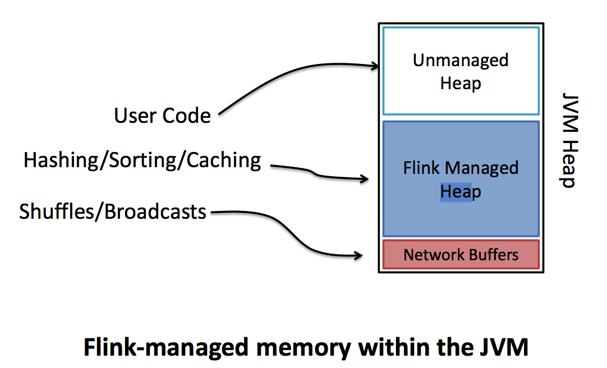

### [9.4、Flink Streaming]()

---
###### [1）、Flink如何保证数据仅且消费一次？]()
    Flink是由source --> transformation --> sink三部分组成；也就是说Flink要实现ExactlyOnce语义与这三者脱不了干系；
    
    数据源Source，首先要支持ExactlyOnce，比如Kafka;
    接着需要对Flink开启checkpoint机制；即开启状态后端，保存其偏移量及中间状态数据；
    Sink端需要支持写覆盖也就是我们经常说的幂等性或者支持事务（两阶段提升）
    
    Flink读取Kafka数据中的checkpoint具体操作如下:
         使用FlinkKafkaConsumer，开启CheckPointing，偏移量会保存通过CheckPoint保存到StateBackend中，并且默认会将偏移量写入Kafka的特殊topic中，即：__consumer_offsets
         FlinkKafkaConsumr的setCommitOffsetsOnCheckpoints参数默认true，即将偏移量写入到Kafka特殊的Topic中，
         目的是为了监控或重启任务没有指定savePoint时可以接着一起的偏移量继续消费并且设置CheckpointingMode.EXACTLY_ONCE
    Barrier【隔离带】可以保证一个流水线中的所有算子都处理成功了，才会对该条数据做CheckPoint
    存储系统不支持覆盖的话，就得要支持事务，成功了提交事务和更新偏移量，如果失败可以回滚且不更新偏移量
    
###### [2）、Flink如何做checkPoint检查点？分布式快照原理是啥?]()
    Flink使用的检查点算法是分布式快照算法（基于Chandy-Lamport算法的分布式快照），将检查点的保存和数据分开处理，不需要暂停整个应用。
    
    检查点分界线(checkpoint barrier):
    Flink检查点算法用到了一种称为分界线(barrier)的特殊数据格式,用来把一条流上数据按照不同的检查点分开.
    分界线之前到来的数据导致的状态修改,都被包含在当前分界线所属的检查点中,而基于分界线之后的数据导致的所有修改,都被包含在之后的检查点中.

###### [3）、Flink程序消费过慢如何解决？]()
###### [4）、统计实时流中某一单词出现的总个数（eg：比如一天某商品被点击的PV）？](bigdata-flink/src/main/scala/com/libin/data/flink/streaming/etl/GenCodeFromState.scala)
###### [5）、Flink中时间有几种？]()
    对于流式数据处理，最大的特点就是数据具有时间的属性，Flink根据时间的产生位置分为三种类型:
    1)事件生成时间（Event Time）:
        事件时间是每个独立事件在产生它的设备上发生的时间，这个时间在事件进入Flink之前就已经嵌入到事件中，时间顺序取决于事件产生的地方，和下游数据处理系统的时间无关。
    2)事件注入时间（Ingestion Time）、
        注入时间是数据进入Flink系统的时间，接入时间依赖Source Operator 所在主机的系统时钟。
        因为接入时间在数据接入过程生成后，时间戳不在发生变化，和后续处理数据的Operator所在机器的时钟没有关系，所以不会因为某台机器时钟不同步或网络延迟而导致计算结果不准确的问题。
    3)事件处理时间(Processing Time)。
        处理时间是指数据在操作算子计算过程中获取到的所在主机时间。当用户选择使用Processing Time 时，所有和时间相关的计算算子，
        例如Linux计算,在当前的任务中所有算子将直接使用其所在主机的系统时间。
    在Flink 中默认情况下使用Processing Time ,如果想用其它的时间类型，则在创建StreamExecutionEnvironment 中调用setStreamTimeCharacteristic()设定时间概念。

###### [6）、Flink中窗口有几种？]()
    滑动窗口（Tumbling Window，无重叠），滚动窗口（Sliding Window，有重叠），和会话窗口（Session Window，活动间隙）。
    
    1)、滚动时间窗口（Tumbling Time Window）
        翻滚窗口能将数据流切分成不重叠的窗口，每一个事件只能属于一个窗口。
        比如：统计每一分钟中用户购买的商品的总数，需要将用户的行为事件按每一分钟进行切分。
    2)、滚动计数窗口（Tumbling Count Window）
        滚动计数窗口会对窗口进行计算。
        比如：想要每100个用户购买行为事件统计购买总数，那么每当窗口中填满100个元素了，就会对窗口进行计算。   
    3)、滑动时间窗口（Sliding Time Window）
        滑动时间窗口是不间断的，需要平滑地进行窗口聚合，一个元素可以对应多个窗口。
        比如：我们可以每30秒计算一次最近一分钟用户购买的商品总数。 
    4)、滑动计数窗口（Sliding Count Window）
        每次滑动指定步数，然后做聚合统计。
        例如：计算每10个元素计算一次最近100个元素的购买总数。
    5)、会话窗口
        在用户交互事件流中，将事件聚合到会话窗口中（一段用户持续活跃的周期），由非活跃的间隙分隔开。
        比如：需要计算每个用户在活跃期间总共购买的商品数量，如果用户30秒没有活动则视为会话断开。
   
###### [7）、Flink中state如何理解？状态机制?]()
    state一般指一个具体的task/operator的状态。Flink中包含两种基础的状态：Keyed State和Operator State。
    1).Keyed State: 就是基于KeyedStream上的状态。这个状态是跟特定的key绑定的，对KeyedStream流上的每一个key，可能都对应一个state。
    2).Operator State: 记录每个Task对应的状态,整个operator只对应一个state。相比较而言，在一个operator上，可能会有很多个key，从而对应多个keyed state。
                    (eg:Flink中的Kafka Connector，就使用了operator state。它会在每个connector实例中，保存该实例中消费topic的所有(partition, offset)映射。)
    
    Keyed State和Operator State，可以以两种形式存在：原始状态和托管状态(Raw and Managed State)。
    1).原始状态(Raw State): 由用户自行管理状态具体的数据结构
    2).托管状态(Managed State): 托管状态是由Flink框架管理的状态，如ValueState, ListState, MapState等。
    框架在做checkpoint的时候，使用byte[]来读写状态内容。通常在DataStream上的状态推荐使用托管的状态，当实现一个用户自定义的operator时，会使用到原始状态。
    
    Keyed State:基于key/value的状态接口，这些状态只能用于keyedStream之上。keyedStream上的operator操作可以包含window或者map等算子操作。
                这个状态是跟特定的key绑定的，对KeyedStream流上的每一个key，都对应一个state。
    key/value下可用的状态接口：
        1).ValueState: 状态保存的是一个值，可以通过update()来更新，value()获取。
        2).ListState: 状态保存的是一个列表，通过add()添加数据，通过get()方法返回一个Iterable来遍历状态值。
        3).ReducingState: 这种状态通过用户传入的reduceFunction，每次调用add方法添加值的时候，会调用reduceFunction，最后合并到一个单一的状态值。
        4).MapState：即状态值为一个map。用户通过put或putAll方法添加元素。
    以上所述的State对象，仅仅用于与状态进行交互（更新、删除、清空等），而真正的状态值，有可能是存在内存、磁盘、或者其他分布式存储系统中。
    
    实际上，这些状态有三种存储方式: HeapStateBackend、MemoryStateBackend、FsStateBackend、RockDBStateBackend。
    1).MemoryStateBackend: state数据保存在java堆内存中，执行checkpoint的时候，会把state的快照数据保存到jobmanager的内存中。
    2).FsStateBackend: state数据保存在taskmanager的内存中，执行checkpoint的时候，会把state的快照数据保存到配置的文件系统中，可以使用hdfs等分布式文件系统。
    3).RocksDBStateBackend: RocksDB跟上面的都略有不同，它会在本地文件系统中维护状态，state会直接写入本地rocksdb中。
                         同时RocksDB需要配置一个远端的filesystem。RocksDB克服了state受内存限制的缺点，同时又能够持久化到远端文件系统中，比较适合在生产中使用。
                
    通过创建一个StateDescriptor，可以得到一个包含特定名称的状态句柄，可以分别创建ValueStateDescriptor、 ListStateDescriptor或ReducingStateDescriptor状态句柄。
    状态是通过RuntimeContext来访问的，因此只能在RichFunction中访问状态。这就要求UDF时要继承Rich函数，例如RichMapFunction、RichFlatMapFunction等。

###### [8）、Flink中Operator是啥？]()
    Task是Flink中执行的基本单位，Operator是算子（Transformation）。
    
    并行数据流(Parallel Dataflows): Flink中把整个流处理过程叫做Stream Dataflow,
        从数据源提取数据的操作叫做Source Operator,中间的map(),聚合、统计等操作可以统称为Tranformation Operators,最后结果数据的流出被称为sink operator。
        Flink的程序内在是并行和分布式的，数据流可以被分区成stream partitions，operators被划分为operator subtasks;这些subtasks在不同的机器或容器中分不同的线程独立运行。
        operator subtasks的数量是operator的并行计算数，程序不同的operator阶段可能有不同的并行数。
    
    数据在两个operator之间传递的时候有两种模式：
        1).one-to-one 模式：两个operator用此模式传递的时候，会保持数据的分区数和数据的排序；
        2).Redistributing模式：这种模式会改变数据的分区数；每个一个operator subtask会根据选择transformation把数据发送到不同的目标subtasks,
                           比如keyBy()会通过hashcode重新分区,broadcast()和rebalance()方法会随机重新分区；
            
    Tasks & Operator Chains:
        对于分布式计算，Flink封装operator subtasks链化为tasks;每个task由一个线程执行；把tasks链化有助于优化，它减少了开销线程和线程之间的交接和缓冲；增加了吞吐量和减少延迟时间；
        (eg:没链化之前, source和map是2个线程运行这2个task,链化之后,source和map合并为一个task，用一个线程执行,这样可以减少source operator和map operator两个线程之间的交接和缓存开销)
    
###### [9）、Flink中StreamExecutionEnvironment初始化流程？]()
###### [10）、用过DataStream里面的哪些方法？]()
    map,flatmap,filter,keyby,reduce,fold,aggregations,window,windowAll,union
###### [11）、Flink程序调优？]()
###### [12）、Flink如何解决数据乱序问题？Watermark使用过么?EventTime+Watermark可否解决数据乱序问题?]()
###### [13）、Flink的checkpoint存储有哪些(状态存储)？]()
###### [14）、Flink如何实现exactly-once？]()
###### [15）、海量key去重,双十一场景,滑动窗口长度为1小时,滑动距离为10s,亿级别用户,如何计算UV？]()
###### [16）、Flink的checkpoint和spark streaming比较？]()
###### [17）、Flink CEP编程中当状态没有达到时候,数据会保存在哪里？]()
###### [18）、3种时间语义？]()
    流处理引擎通常为用户的应用程序提供三种数据处理语义：最多一次，至少一次和精确一次。
    1).最多一次（At-most-Once）：这种语义理解起来很简单，用户的数据只会被处理一次，不管成功还是失败，不会重试也不会重发。
    2).至少一次（At-least-Once）：这种语义下，系统会保证数据或事件至少被处理一次。如果发生错误或者丢失，那么会从源头重新发送一条然后进入处理系统。所以同一个事件或者消息会被处理很多次。
    3).精确一次（Exactly-Once）：表示每一条数据只会被精确地处理一次，不多也不少。
    ”精确一次“语义是Flink 1.4.0版本引入的一个重要特性，而且，Flink号称支持”端到端的精确一次“语义。
    
    这里解释一下”端到端的精确一次“，它指的是Flink应用从Source端开始到Sink端结束，数据必须经过的起始点和结束点。
    Flink自身是无法保证外部系统”精确一次“语义的，所以Flink若要实现所谓”端到端的精确一次“的要求，那么外部系统必须支持”精确一次“语义，然后借助Flink提供的分布式快照和两阶段提交才能实现。

    Flink在1.4版本引入了一个很重要得功能：两阶段提交，也即是TwoPhaseCommitSinkFunction。两阶段搭配特定得source和sink（特别是0.11版本kafka）使得”精确一次处理语义“成为可能。

###### [19）、Flink面对高峰数据如何处理？]()
###### [20）、Flink程序运行慢如何优化处理？]()
###### [21）、Flink程序延迟高如何解决？]()
###### [22）、Flink如何做容错？]()
###### [23）、Flink有没有重启策略？说说有哪几种?]()
###### [24）、Flink分布式快照原理是什么?]()
###### [25）、Flink的Kafka连接器有什么特别的地方?]()
###### [26）、Flink的内存管理?]()
    在flink中内存被分为三个部分，分别是Unmanaged区域，Managed区域，Network-Buffer区域
        1).Unmanaged区域: 是指flink不管理这部分区域，它的管理由JVM管理，用于存放User Code
        2).Managed区域: 是指flink管理这部分区域，它不受jvm管理不存在GC问题，用于存放Hashing,Sorting,Caching等数据
        3).Network-Buffer区域: 是指flink在进行计算时需要通过网络进行交换数据的区域。用于存放Shuffles，Broadcasts数据。
  

    flink在JVM的heap内有自己的内存管理空间。
    为了解决大量对象在JVM的heap上创建会带来OOM和GC的问题，flink将大量使用的内存存放到堆外.
    flink在堆外有一块预分配的固定大小的内存块MemorySegment，flink会将对象高效的序列化到这块内存中。
    MemorySegment由许多小的内存cell组成，每个cell大小32kb，这也是flink分配内存的最小单位。你可以把 MemorySegment想象成是为Flink 定制的 java.nio.ByteBuffer。
    它的底层可以是一个普通的 Java 字节数组（byte[]），也可以是一个申请在堆外的 ByteBuffer。每条记录都会以序列化的形式存储在一个或多个MemorySegment中。
    如果MemorySegment中依然放不小所有的数据，flink会将数据写入磁盘，需要的时候再冲磁盘读出来。

###### [27）、Flink序列化都有哪些?怎么实现的?]()
###### [28）、Flink的window出现了数据倾斜,如何解决?]()
###### [29）、Flink在使用聚合函数GroupBy、KeyBy、Distinct等函数出现数据热点如何解决?]()
###### [30）、Flink如何处理反压?和spark streaming和storm区别有了解么?]()
###### [31）、Flink的Operator Chains算子链了解么?]()
    flink的整个数据处理流程是由一个个operator组成的，数据从源头开始传递给一个个operator进行链式处理，每一个处理逻辑就是一个operator，
    一个operator包含一个输入、一个处理逻辑、一个输出，operator是在TaskManager的slot中执行的，
    
    为了更高效地分布式执行，Flink会尽可能地将operator的subtask链接（chain）在一起形成task。每个task在一个线程中执行。
    一个slot就是一个线程，一个operator只能在一个slot中执行，一个slot中可以运行多个operator(同一个job任务)，
    flink会进行优化将多个operator放在一个slot中运行，它能减少线程之间的切换，减少消息的序列化/反序列化，减少数据在缓冲区的交换，减少了延迟的同时提高整体的吞吐量。

###### [32）、Flink什么时候会把Operator Chain在一起行程算子链?]()
    operator chain是指将满足一定条件的operator 链在一起，放在同一个task里面执行，是Flink任务优化的一种方式，
    相同并行度的one to one操作，在Flink中，这样相连的operator 链接在一起形成一个task，原来的operator成为里面的subtask。
    将operators链接成task是非常有效的优化：它能减少线程之间的切换和基于缓存区的数据交换，在减少时延的同时提升吞吐量。
    在同一个task里面的operator的数据传输变成函数调用关系，这种方式减少数据传输过程。常见的chain例如：source->map->filter
    
    OperatorChain的优点: 1).减少线程切换
                        2).减少序列化与反序列化
                        3).减少延迟并且提高吞吐能力
    OperatorChain组成条件: 1).上下游算子并行度一致
                          2).上下游算子之间没有数据shuffle

###### [33）、Flink1.7特性?Flink1.9特性]()
###### [34）、Flink组件栈有哪些?]()
    Flink的架构体系遵行分层架构设计的理念，基本上分为三层，API&Libraries层、Runtine核心层以及物理部署层。
    API&Libraries层：提供了支撑流计算和批计算的接口，同时在此基础之上抽象出不同的应用类型的组件库。
    Runtime核心层：负责对上层不同接口提供基础服务,支持分布式Stream作业的执行、JobGraph到ExecutionGraph的映射转换、任务调度等，将DataStream和DataSet转成统一的可执行的Task Operator.
    物理部署层：Flink 支持多种部署模式，本机，集群（Standalone/YARN）、云（GCE/EC2）、Kubenetes。

###### [35）、Flink运行需要依赖哪些组件?必须依赖Hadoop么?]()
###### [36）、Flink基础编程模型?]()
###### [37）、Flink集群有哪些角色?各有什么作用?]()
###### [38）、Flink中Task Slot概念?Slot和parallelism区别?]()
    worker: 每一个worker(TaskManager)是一个JVM进程，它可能会在独立的线程上执行一个或多个subtask。
    slots: 为了控制一个worker能接收多少个task，worker通过task slot来进行控制（一个worker至少一个task slot）。每个task slot表示TaskManager拥有资源的一个固定大小的子集。
           假如一个TaskManager有三个slot，那么它会将其管理的内存分成三份给各个slot。不会涉及到CPU的隔离，slot目前仅仅用来隔离task的受管理的内存。
    
    Flink程序的执行具有并行、分布式的特性。
    一个特定operator的subtask的个数被称之为其parallelism(并行度)。
    Stream在operator之间传输数据的形式可以是one-to-one(forwarding)的模式也可以是redistributing的模式，具体是哪一种形式，取决于operator的种类。
    
    slot 和 parallelism关系:
        slot 是指 taskmanager 的并发执行能力。
        parallelism 是指 taskmanager 实际使用的并发能力。

###### [39）、Flink中常用算子有哪些?]()
###### [40）、Flink分区策略?]()
###### [41）、Flink并行度如何设置?]()
###### [42）、Flink分布式缓存用过没?如何使用?]()
###### [43）、Flink广播变量,使用时候需要注意什么?]()
###### [44）、Flink Table&SQL熟悉不?TableEnvironment这个类有什么作用?]()
###### [45）、Flink SQL实现原理是什么?如何实现SQL的解析?]()
###### [46）、Flink如何支持流批一体的?]()
###### [47）、Flink如何支如何做到高效的数据转换?]()
###### [48）、Flink如何做内存管理?]()
###### [49）、Flink Job提交流程?]()
###### [50）、Flink的三层图结构是哪几个图?]()
###### [51）、Flink中JobManager在集群中扮演的角色?]()
###### [52）、Flink中JobManager在集群启动中扮演的角色?]()
###### [53）、Flink中TaskManager在集群中扮演的角色?]()
###### [54）、Flink中TaskManager在集群启动时候扮演的角色?]()
###### [55）、Flink计算资源的调度是如何实现的?]()
###### [56）、简述Flink的数据抽象以及数据交换过程?]()
###### [57）、FlinkSQL的实现原理?]()
###### [58）、Flink压测和监控?]()
###### [59）、有了Spark为啥还要用Flink?]()
###### [60）、Flink的应用架构有哪些?]()
###### [61）、Flink Barrier对齐?]()
###### [62）、Flink slot和cpu core区别?]()
    Flink中每一个worker(TaskManager)都是一个JVM进程，它可能会在独立的线程（Solt）上执行一个或多个 subtask。Flink 的每个 TaskManager 为集群提供 Solt。
    Solt 的数量通常与每个 TaskManager 节点的可用 CPU 内核数成比例，一般情况下 Slot 的数量就是每个节点的 CPU 的核数。
    Slot的数量与CPU-core的数量一致为好。但考虑到超线程，可以让slotNumber=2*cpuCore。
    
    指定了每个TaskManager内存 为3G 那么一个TM里面有3个Slot，每个Slot 分到1G内存 。
    
    Flink TaskManager的slot有点类似于Spark的executor.

###### [63）、JobGraph生成?]()

---
参考:
* [1.Flink官网](http://flink.iteblog.com/dev/stream/state.html)
* [2.Flink简明实战教程](https://liguohua-bigdata.gitbooks.io/simple-flink/content/book/memory/memory.html)
