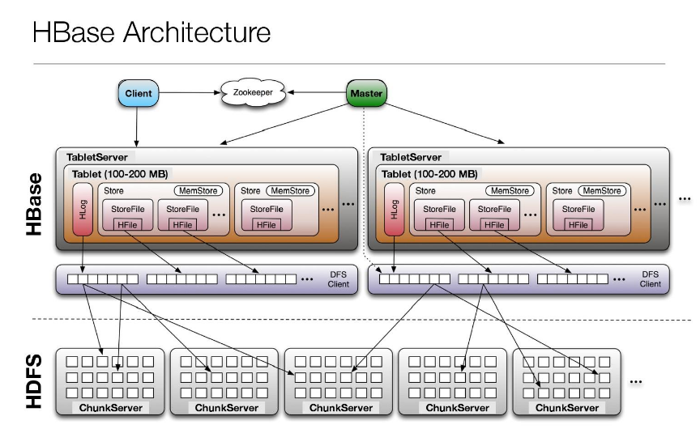

* [9.7、HBase](hbase.md)
    - [1）、HBase是什么？特点有哪些？]()
    - [2）、HBase和Hive的区别？]()
    - [3）、HBase的rowKey如何设计？]()
    - [4）、简述HBase架构模块？]()
    - [5）、描述HBase中一个cell结构？]()
    - [6）、HBase中compact用途是什么？什么时候触发？分为哪两种？有什么区别？有哪些相关参数？]()
    - [7）、HBase优化？]()
    - [8）、HBase如何建立预分区？]()
    - [9）、HBase中HRegionServer宕机如何处理？]()
    - [10）、HBase中scan和get的功能以及实现的异同？]()
    - [11）、HBase读流程？]()
    - [12）、HBase写流程？]()
    - [13）、HBase内部机制是什么？]()
    - [14）、HBase在进行模型设计时重点在什么地方？一张表定义多个Column Family最合适？为什么？]()
    - [15）、如何提高HBase客户端的读写性能？]()
    - [16）、直接将时间戳作为行键存储在HBase中，在写入单个Region时候会发生热点问题，为什么？]()
    - [17）、请描述如何解决HBase中Region太大和Region太小带来的冲突？]()
    - [18）、简述下布隆过滤器的原理？HBase中如何使用的？]()
    - [19）、简述下LSM树的原理？HBase中如何使用的？]()
    - [20）、HBase中二级索引原理？有使用过么？]()
    - [21）、HBase有put方法，那如何批量进HBase中？用什么方法？]()
    - [22）、访问HBase有哪些方式？]()
    - [23）、HBase中最小存储单元是什么？]()
    - [24）、HBase中的MemStore是用来做什么的？]()
    - [25）、HBase中scan对象的setCache和setBatch方法的使用？]()
    - [26）、每天百亿数据存入HBase，如何保证数据的存储正确以及在规定时间里全部录入完毕，不残留数据？]()
    - [27）、HBase的RowFilter和BloomFilter原理？]()
    - [28）、HBase的HRegion如何划分的？]()
---
###### [1）、HBase是什么？特点有哪些？]()
    hbase是一个分布式的、面向列的开源数据库，它是一个适合于非结构化数据存储的数据库。
    hbase的特点是：1、海量存储；2、列式存储；3、极易扩展；4、高并发；5、稀疏。
    
    1.hbase是一个分布式的，基于列式存储的数据库，基于hadoop的hdfs存储，zookeeper进行管理。
    2.hbase 适合存储半结构化或非结构化的数据，比如数据结构字段不够确定或者杂乱无章很难按照一个概念去抽取的数据。
    3.hbase的存储效率比较高，为null的数据不会被存储。
    4.hbase的表包含rowKey、列族和列，存储数据的最小单元是单元格，单元格包含数据及其对应的写入时间戳，新写入数据时，附带写入时间戳，可以查询到之前写入的多个版本。

###### [2）、HBase和Hive的区别？]()
    Hbase： Hadoop database 的简称，也就是基于Hadoop数据库，是一种NoSQL数据库，主要适用于海量明细数据（十亿、百亿）的随机实时查询，如日志明细、交易清单、轨迹行为等。
    Hive：Hive是Hadoop数据仓库，严格来说，不是数据库，主要是让开发人员能够通过SQL来计算和处理HDFS上的结构化数据，适用于离线的批量数据计算。

###### [3）、HBase的rowKey如何设计？]()
    ① Rowkey 长度原则
    Rowkey 是一个二进制码流，一般是10~100个字节，建议越短越好，不超过16字节为宜。
    ② Rowkey 散列原则
    如果Rowkey 是按时间戳的方式递增，不要将时间放在二进制码的前面，建议将Rowkey的高位作为散列字段，由程序循环生成，低位放时间字段，这样将提高数据均衡分布在每个Regionserver 实现负载均衡的几率。
    ③ Rowkey 唯一原则
    必须在设计上保证其唯一性。

###### [4）、简述HBase架构模块？]()
  

    HMaster链接Zookeeper的目的：HMaster需要知道哪些HRegionServere是活的及HRegionServer所在的位置，然后管理HRegionServer。
    HBase内部是通过DFS client把数据写到HDFS上的
    每一个HRegionServer有多个HRegion，每一个HRegion有多个Store，每一个Store对应一个列簇。
    HFile是HBase中KeyValue数据的存储格式，HFile是Hadoop的二进制格式文件，StoreFile就是对HFile进行了封装，然后进行数据的存储。
    HStore由MemStore和StoreFile组成。
    HLog记录数据的所有变更，可以用来做数据恢复。
    hdfs对应的目录结构为:namespace->table->列簇->列->单元格

###### [5）、描述HBase中一个cell结构？]()
    cell：由{row key, column(=<CF> + <CQ>), version}唯一确定的单元，cell中的数据是没有类型的，全部是字节码形式存储。

###### [6）、HBase中compact用途是什么？什么时候触发？分为哪两种？有什么区别？有哪些相关参数？]()
    在 hbase 中每当有 memstore 数据 flush 到磁盘之后，就形成一个 storefile，当 storeFile 的数量达到一定程度后，就需要将storefile文件来进行 compaction 操作。
    
    Compact 的作用：
    1>.合并文件
    2>.清除过期，多余版本的数据
    3>.提高读写数据的效率
    HBase 中实现了两种 compaction 的方式：minor and major。
    
    1、 Minor 操作只用来做部分文件的合并操作以及包括 minVersion=0，并且设置 ttl 的过期版本清理，不做任何删除数据、多版本数据的清理工作。
    2、 Major 操作是对 Region 下的 HStore 下的所有 StoreFile 执行合并操作，最终的结果是整理合并出一个文件。

###### [7）、HBase优化？]()
    Region：根据你的RowKey设计来进行预建分区，减少region的动态分裂。 
    HFile：估计项目数据量大小，给HFile设定一个合适的值。
    Compaction：关闭Compaction，在闲时进行手动Compaction
    BulkLoad：批量数据写入时采用BulkLoad
    BloomFilter：开启BloomFilter，BloomFilter是列族级别的过滤，在生成一个StoreFile同时会生成一个MetaBlock，用于查询时过滤数据
    压缩：一般推荐使用Snappy和LZO压缩 
    RowKey：合理设计RowKey
    列族：多列族设计对减少的作用不是很明显，适用于读多写少的场景 

###### [8）、HBase如何建立预分区？]()
    HBase默认建表时只有一个Region，这个Region的Rowkey是没有边界的，即没有StartKey和EndKey，在数据写入时，
    所有数据都会写入这个默认的Region，随着数据量的不断增加，此Region已经不能承受不断增长的数据量，会进行split，分成两个Region。
    在此过程中，会产生两个问题：1)数据往一个Region上写会有写热点问题，2）Region split会消耗宝贵的集群IO资源
    
    基于此，我们可以控制在创建表的时候，创建多个空Region，并确定每个Region的起始和结束Rowkey，
    这样只要我们的Rowkey设计能够均匀的命中各个Region，就不会存在写热点问题。自然split的几率也会大大降低。
    当随着数据量的不断增长，该split的还是要进行split。像这样预先创建HBase表分区的方式，称之为预分区。

###### [9）、HBase中HRegionServer宕机如何处理？]()
    引起RegionServer宕机的原因各种各样，有因为Full GC导致、网络异常导致、官方Bug导致（close wait端口未关闭）以及DataNode异常导致等等。
    
    HBase检测宕机是通过Zookeeper实现的， 正常情况下RegionServer会周期性向Zookeeper发送心跳，一旦发生宕机，心跳就会停止，
    超过一定时间（SessionTimeout）Zookeeper就会认为RegionServer宕机离线，并将该消息通知给Master。
    
    一旦RegionServer发生宕机，HBase Master通过zookeeper集群会马上检测到这种宕机，
    并且在检测到宕机之后会将宕机RegionServer上的所有Region重新分配到集群中其他正常RegionServer上去，再根据HLog进行丢失数据恢复，
    恢复完成之后就可以对外提供服务，整个过程都是自动完成的，并不需要人工介入. 

###### [10）、HBase中scan和get的功能以及实现的异同？]()
    Get的功能是精准查找，按指定RowKey 获取唯一一条记录。
    Scan的功能是范围查找，按指定的条件获取一批记录。
    实际上它们的实现是一样的，get操作就是一种特殊的scan（begin和end相同的scan操作）。而且hbase读数据的操作都是scan，代码级别实现的是scan，并没有特别针对get的操作。

###### [11）、HBase读流程？]()
    ① HRegionServer保存着meta表以及表数据，要访问表数据，首先Client先去访问zookeeper，从zookeeper里面获取meta表所在的位置信息，即找到这个meta表在哪个HRegionServer上保存着。
    ② 接着 Client 通过刚才获取到的 IP 访问对应的HRegionServer，获取到 Meta 表中存放的元数据。
    ③ Client 通过元数据中存储的信息，访问对应的 HRegionServer，然后扫描所在HRegionServer 的 Memstore 和 Storefile 来查询数据。
    ④ 最后 HRegionServer 把查询到的数据响应给 Client。

###### [12）、HBase写流程？]()
    ① Client 先访问 zookeeper，找到 Meta 表，并获取 Meta 表元数据。
    ② 确定当前将要写入的数据所对应的 HRegion 和 HRegionServer 服务器。
    ③ Client 向该 HRegionServer 服务器发起写入数据请求，然后 HRegionServer 收到请求并响应。
    ④ Client 先把数据写入到 HLog，以防止数据丢失。
    ⑤ 然后将数据写入到 Memstore。
    ⑥ 如果 HLog 和 Memstore 均写入成功，则这条数据写入成功
    ⑦ 如果 Memstore 达到阈值，会把 Memstore 中的数据 flush 到 Storefile 中。
    ⑧ 当 Storefile 越来越多，会触发 Compact 合并操作，把过多的 Storefile 合并成一个大的 Storefile。
    ⑨ 当 Storefile 越来越大，Region 也会越来越大，达到阈值后，会触发 Split 操作，将Region 一分为二。

###### [13）、HBase内部机制是什么？]()
    Hbase是一个能适应联机业务的数据库系统
    物理存储：hbase的持久化数据是将数据存储在HDFS上。
    存储管理：一个表是划分为很多region的，这些region分布式地存放在很多regionserver上Region内部还可以划分为store，store内部有memstore和storefile。
    版本管理：hbase中的数据更新本质上是不断追加新的版本，通过compact操作来做版本间的文件合并Region的split。
    集群管理：ZooKeeper + HMaster + HRegionServer。

###### [14）、HBase在进行模型设计时重点在什么地方？一张表定义多个Column Family最合适？为什么？]()
    Column Family的个数具体看表的数据，一般来说划分标准是根据数据访问频度，如一张表里有些列访问相对频繁，而另一些列访问很少，这时可以把这张表划分成两个列族，分开存储，提高访问效率。
    Column Family数量不要太多,一个列簇对应一个store

###### [15）、如何提高HBase客户端的读写性能？]()
    开启bloomfilter过滤器，开启bloomfilter比没开启要快3、4倍
    Hbase对于内存有特别的需求，在硬件允许的情况下配足够多的内存给它
    通过修改hbase-env.sh中的 export HBASE_HEAPSIZE=3000 #这里默认为1000m
    增大RPC数量

###### [16）、直接将时间戳作为行键存储在HBase中，在写入单个Region时候会发生热点问题，为什么？]()
    region中的rowkey是有序存储，若时间比较集中。就会存储到一个region中，这样一个region的数据变多，其它的region数据很少，加载数据就会很慢，直到region分裂

###### [17）、请描述如何解决HBase中Region太大和Region太小带来的冲突？]()
    Region过大会发生多次compaction，将数据读一遍并重写一遍到hdfs 上，占用io，region过小会造成多次split，region 会下线，影响访问服务，
    最佳的解决方法是调整hbase.hregion. max.filesize 为256m。

###### [18）、简述下布隆过滤器的原理？HBase中如何使用的？]()
    hbase的storefile有很多，随机查的时候可能需要遍历很多storefile，如果在建表的时候指定了bloomfilter，则在get查询（scan不管用）的时候就可以过滤掉很多不符合规则的storefile，
    提高查询效率。

###### [19）、简述下LSM树的原理？HBase中如何使用的？]()
    LSM树使得HBase具有高性能的读写能力
    HBase使用了一种LSM的存储结构，在LSM树的实现方式中，会在数据存储之前先对数据进行排序。
    LSM树是Google BigTable和HBase的基本存储算法，它是传统关系型数据库的B+树的改进。
    算法的核心在于尽量保证数据是顺序存储到磁盘上的，并且会有频率地对数据进行整理，确保其顺序性。
    LSM树就是一堆小树，在内存中的小树即memstore，每次flush，内存中的memstore变成磁盘上一个新的storefile。这种批量的读写操作使得HBase的性能较高。

###### [20）、HBase中二级索引原理？有使用过么？]()
    默认情况下，Hbase只支持rowkey的查询，对于多条件的组合查询的应用场景不太友好。
    如果将多条件组合查询的字段都拼接在RowKey中显然又不太可能，全表扫描再结合过滤器筛选出目标数据(太低效)，所以通过设计HBase的二级索引来解决这个问题。
    这里所谓的二级索引其实就是创建新的表，并建立各列值（family：column）与行键（rowkey）之间的映射关系。这种方式需要额外的存储空间，属于一种以空间换时间的方式

###### [21）、HBase有put方法，那如何批量进HBase中？用什么方法？]()
    

###### [22）、访问HBase有哪些方式？]()
    

###### [23）、HBase中最小存储单元是什么？]()
    HBase 会对表按行进行切分，划分为多个区域块儿，每个块儿名为 HRegion
    HBase 是集群结构，会把这些块儿分散存储到多个服务器中，每个服务器名为 HRegionServer
    HRegion 是 HBase 中分布式存储的最小单元，但并不是存储的最小单元
    HRegion 内部会按照列族进行切分，分为多个 Store，每个 Store 保存一个列族，所以 HRegion 由一个或者多个 Store 组成
    每个 Strore 又由一个 MemStore 和 N个 StoreFile 组成
    MemStore 是内存存储单元，当内存中数据达到阈值后，写入 StoreFile，StoreFile 以 HFile 格式保存

###### [24）、HBase中的MemStore是用来做什么的？]()
    MemStore 是内存里的写入缓冲区，HBase 中数据在永久写入硬盘之前在这里累积。
    当MemStore 填满后，其中的数据会刷写到硬盘，生成一个HFile。HFile 是HBase 使用的底层存储格式。
    HFile 对应于列族，一个列族可以有多个 HFile，但一个 HFile 不能存储多个列族的数据。

###### [25）、HBase中scan对象的setCache和setBatch方法的使用？]()
    setCache用于设置缓存，即设置一次RPC请求可以获取多行数据。
    setBatch 用于设置批量处理，批量可以让用户选择每一次ResultScanner实例的next操作要取回多少列，例如，在扫描中设置setBatch(5)，则一次next()返回的Result实例会包括5列。

###### [26）、每天百亿数据存入HBase，如何保证数据的存储正确以及在规定时间里全部录入完毕，不残留数据？]()
    数据量百亿条，什么概念呢？假设一整天60x60x24 = 86400秒都在写入数据，那么每秒的写入条数高达100万条，HBase当然是支持不了每秒百万条数据的，
    所以这百亿条数据可能不是通过实时地写入，而是批量地导入。批量导入推荐使用BulkLoad方式,性能是普通写入方式几倍以上；
    存入HBase：普通写入是用JavaAPI put来实现，批量导入推荐使用BulkLoad；
    保证数据的正确：这里需要考虑RowKey的设计、预建分区和列族设计等问题；
    在规定时间内完成也就是存入速度不能过慢，并且当然是越快越好，使用BulkLoad。

###### [27）、HBase的RowFilter和BloomFilter原理？]()

###### [28）、HBase的HRegion如何划分的？]()
    Table中所有行都按照row key的字典序排列。
    Table在行的方向上分割为多个HRegion。
    HRegion按大小分割的，每个表开始只有一个HRegion，随着数据增多，HRegion不断增大，当增大到一个阀值的时候，HRegion就会等分会两个新的HRegion，之后会有越来越多的Region。
    HRegion是Hbase中分布式存储和负载均衡的最小单元，不同HRegion分布到不同HRegionServer上。
