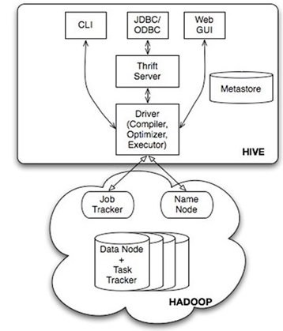

* [9.6、Hive](hive.md)
    - [1）、简述Hive主要结构？]()
    - [2）、Hive解析成MapReduce过程？]()
    - [3）、Hive与传统数据库的区别？]()
    - [4）、Hive内部表和外部表区别？]()
    - [5）、Hive中order by、sort by、distribute by和cluster by的区别？]()
    - [6）、Hive中row_number()、rank()和dense_rank()区别？]()
    - [7）、Hive中常用的系统函数有哪些？]()
    - [8）、Hive使用过udf函数么？如何使用的？]()
    - [9）、Hive如何实现分区？]()
    - [10）、Hive导入和导出数据的方式？]()
    - [11）、Hive窗口函数有哪些?]()
    - [12）、Hive中如何使用UDTF?]()
    - [13）、Hive表关联查询，如何解决数据倾斜问题？]()
    - [14）、Hive中数据的null在底层是如何存储的？]()
    - [15）、Hive有哪些方式保存元数据？各有哪些特点？]()
    - [16）、Hive中split、coalesce和collect_list函数的用法？]()
    - [17）、Hive在join时候大表和小表放置顺序？]()
    - [18）、Hive使用两张表关联，使用MapReduce怎么实现？]()
    - [19）、Hive中使用什么可以代替in查询？]()
    - [20）、所有的Hive任务底层都会执行MapReduce么？]()
    - [21）、Hive函数中UDF、UDAF和UDTF区别？]()
    - [22）、Hive桶表的理解？]()
    - [23）、Hive实现UDF函数的流程？]()
    - [24）、Hive SQL语句是怎么执行的？]()
    - [25）、Hive用过哪些优化？]()
    - [26）、Hive如何设置并行数？]()
    - [27）、Hive如何合并小文件？]()
    - [28）、Hive动态分区？]()
---
###### [1）、简述Hive主要结构？]()
  
    
    1.用户接口主要有三个：CLI，Client 和 WUI。
    最常用的是CLI，Cli启动的时候，会同时启动一个Hive副本。
    Client是Hive的客户端，用户连接至Hive Server。在启动 Client模式的时候，需要指出Hive Server所在节点，并且在该节点启动Hive Server。 
    WUI是通过浏览器访问Hive。
    2.Hive将元数据存储在数据库中，如mysql、derby。Hive中的元数据包括表的名字，表的列和分区及其属性，表的属性（是否为外部表等），表的数据所在目录等。
    3.解释器、编译器、优化器完成HQL查询语句从词法分析、语法分析、编译、优化以及查询计划的生成。生成的查询计划存储在HDFS中，并在随后有MapReduce调用执行。
    4.Hive的数据存储在HDFS中，大部分的查询、计算由MapReduce完成（包含*的查询，比如select * from tbl不会生成MapRedcue任务）。

###### [2）、Hive解析成MapReduce过程？]()
###### [3）、Hive与传统数据库的区别？]()
    查询语言不同,传统数据库用的是SQL语句,hive是集成的HQL语句.
    数据存储地方不同,不同于传统数据库存储在原始设备或本地文件系统(Raw Device or Local FS),Hive 存储在HDFS.
    执行方式不同,传统数据库是Excutor单元执行,hive是MapReduce
    同时hive执行延迟高,处理数据规模大,无索引(0.8版本后才加入位图索引,mysql有复杂的索引),都是hive与传统的区别. 

###### [4）、Hive内部表和外部表区别？]()
###### [5）、Hive中order by、sort by、distribute by和cluster by的区别？]()
###### [6）、Hive中row_number()、rank()和dense_rank()区别？]()
    row_number() over() : 排名函数，不会重复，适合于生成主键或者不并列排名
    rank() over() :  排名函数，有并列名次，名次不连续。如:1,1,3
    dense_rank() over() : 排名函数，有并列名次，名次连续。如：1，1，2

###### [7）、Hive中常用的系统函数有哪些？]()
###### [8）、Hive使用过udf函数么？如何使用的？]()
     Hive中有三种UDF:
      1、用户定义函数(user-defined function)UDF
      2、用户定义聚集函数（user-defined aggregate function，UDAF）
      3、用户定义表生成函数（user-defined table-generating function，UDTF）。
      
      UDF操作作用于单个数据行，并且产生一个数据行作为输出。大多数函数都属于这一类（比如数学函数和字符串函数）。
      UDAF 接受多个输入数据行，并产生一个输出数据行。像COUNT和MAX这样的函数就是聚集函数。
      UDTF 操作作用于单个数据行，并且产生多个数据行，一个表作为输出。lateral view explore()。
      
      简单来说：
        UDF:返回对应值，一对一
        UDAF：返回聚类值，多对一
        UDTF：返回拆分值，一对多
        
      UDF：
      1、UDF函数可以直接应用于select语句，对查询结构做格式化处理后，再输出内容。
      2、编写UDF函数的时候需要注意一下几点：
        a）自定义UDF需要继承org.apache.hadoop.hive.ql.UDF。
        b）需要实现evaluate函数，evaluate函数支持重载。
      
      例：写一个返回字符串长度的Demo:
      import org.apache.hadoop.hive.ql.exec.UDF;
      public class GetLength extends UDF{
          public int evaluate(String str) {
              try{
                  return str.length();
              }catch(Exception e){
                  return -1;
              }
          }
      }
      3、步骤
        a）把程序打包放到目标机器上去；
        b）进入hive客户端，添加jar包：
            hive> add jar /root/hive_udf.jar
        c）创建临时函数：
            hive> create temporary function getLen as 'com.raphael.len.GetLength';
        d）查询HQL语句：
            hive> select getLen(info) from apachelog;
        e）销毁临时函数：
            hive> DROP TEMPORARY FUNCTION getLen;

###### [9）、Hive如何实现分区？]()
###### [10）、Hive导入和导出数据的方式？]()
###### [11）、Hive窗口函数有哪些?]()
    聚合函数:
        sum：求和    
        count：计算总数 
        max：最大值
        min：最小值
        avg：平均值
    窗口函数:
        over（）：指定分析函数工作的窗口的大小。
        current row：当前行
        n preceding:往前n行数据
        n following:往后n行数据

###### [12）、Hive中如何使用UDTF?]()
###### [13）、Hive表关联查询，如何解决数据倾斜问题？]()
###### [14）、Hive中数据的null在底层是如何存储的？]()
###### [15）、Hive有哪些方式保存元数据？各有哪些特点？]()
###### [16）、Hive中split、coalesce和collect_list函数的用法？]()
###### [17）、Hive在join时候大表和小表放置顺序？]()
###### [18）、Hive使用两张表关联，使用MapReduce怎么实现？]()
###### [19）、Hive中使用什么可以代替in查询？]()
###### [20）、所有的Hive任务底层都会执行MapReduce么？]()
###### [21）、Hive函数中UDF、UDAF和UDTF区别？]()
###### [22）、Hive桶表的理解？]()
###### [23）、Hive实现UDF函数的流程？]()
###### [24）、Hive SQL语句是怎么执行的？]()
###### [25）、Hive用过哪些优化？]()
###### [26）、Hive如何设置并行数？]()
###### [27）、Hive如何合并小文件？]()
###### [28）、Hive动态分区？]()