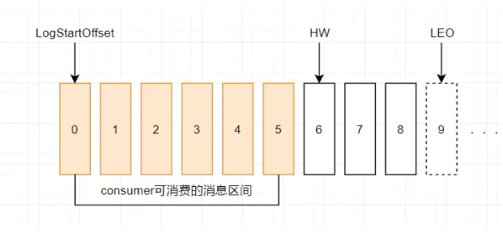

* [9.13、Kafka](bigdata-project/src/main/doc/kafka.md)
    - [1）、Kafka如何保证消息的顺序？]()
    - [2）、Kafka的receiver和direct区别？]()
    - [3）、Kafka和Flink保证仅消费一次ExactlyOnce？]()
    - [4）、Kafka中ISR、AR表示什么？]()
    - [5）、Kafka中HW、LEO等表示什么意思？]()
    - [6）、Kafka中是怎么体现消息顺序性的？]()
    - [7）、Kafka中分区器、序列化器、拦截器是否了解？它们之间的顺序使什么？]()
    - [8）、Kafka生产者客户端整体结构式什么样子的？使用了几个线程处理？分别是什么？]()
    - [9）、Kafka消费组中的消费者个数如果超过了topic的分区，那么就会有消费者消费不到数据，这句话是否正确？]()
    - [10）、Kafka中消费者提交消费位移时提交的是当前消费到的最新消息offset还是offset+1？]()
    - [11）、Kafka中有哪些情形会造成重复消费？]()
    - [12）、Kafka中有哪些情形会造成消息漏消费？]()
    - [13）、当使用kafka-topics.sh创建(删除)一个topic之后，kafka背后会执行什么逻辑？]()
    - [14）、Kafka的topic分区数可不可以增加？如果可以怎么增加？如果不可以，那又是为什么？]()
    - [15）、Kafka的topic分区数可不可以减少？如果可以怎么增加？如果不可以，那又是为什么？]()
    - [16）、Kafka有内部的topic么？如果有是什么？有什么用？]()
    - [17）、Kafka分区分配的概念？]()
    - [18）、简述Kafka日志目录结构？]()
    - [19）、如果指定了一个offset，Kafka Controller怎么找到对应的消息？]()
    - [20）、Kafka Controller的作用？]()
    - [21）、Kafka中有哪些地方需要选举，这些地方的选举策略有哪些？]()
    - [22）、Kafka失效副本是指什么？有哪些应对策略？]()
    - [23）、Kafka的哪些设计让它有如此高的性能？]()
    - [24）、简述Kafka的基础架构？]()
    - [25）、Kafka的用途有哪些？适用于哪些使用场景？]()
    - [26）、Kafka中过期数据清理？]()
    - [27）、Kafka中幂等是怎么实现的？]()
    - [28）、Kafka中优先副本是什么？有什么特殊的作用？]()
    - [29）、Kafka中zookeeper作用是什么？]()
    - [30）、Kafka的ACK机制？]()
    - [31）、Kafka如何实现ExactlyOnce？]()

---
###### [1）、Kafka如何保证消息的顺序？]()
    在Kafka中，只保证Partition(分区)内有序，不保证Topic所有分区都是有序的。
    所以 Kafka 要保证消息的消费顺序，可以有2种方法：
    一、1个Topic（主题）只创建1个Partition(分区)，这样生产者的所有数据都发送到了一个Partition(分区)，保证了消息的消费顺序。
    二、生产者在发送消息的时候指定要发送到哪个Partition(分区)。
        我们需要将 producer 发送的数据封装成一个 ProducerRecord 对象。
        （1）指明 partition 的情况下，直接将指明的值直接作为 partiton 值；
        （2）没有指明partition值但有key的情况下，将key的hash值与topic的partition数进行取余得到partition值；
        （3）既没有 partition 值又没有 key 值的情况下，第一次调用时随机生成一个整数（后面每次调用在这个整数上自增），
            将这个值与topic可用的partition总数取余得到partition值，也就是常说的round-robin算法。

###### [2）、Kafka的receiver和direct区别？]()
    1).基于Receiver的方式: 
    这种方式使用Receiver来获取数据。Receiver是使用Kafka的高层次Consumer API来实现的。
    receiver从Kafka中获取的数据都是存储在Spark Executor的内存中的，然后Spark Streaming启动的job回去处理那些数据。
    2).基于Direct的方式
    在Spark1.3中引入的，能够确保更加健壮的机制。替代掉使用Receiver来接收数据后，这种方式会周期性地查询Kafka，来获得每个topic+partition的最新的offset，从而定义每个batch的offset的范围。
    当处理数据的job启动时，就会使用Kafka的简单consumer api来获取Kafka指定offset范围的数据

###### [3）、Kafka和Flink保证仅消费一次ExactlyOnce？]()
    flink通过checkpoint保证了flink应用内部的exactly-once语义，通过TwoPhaseCommitSinkFunction可以保证端到端的exactly-once语义。
    
    要求source和sink的外部系统都必须是支持分布式事务的，能够支持回滚和提交。然而一个简单的提交和回滚，对于一个分布式的流式数据处理系统来说是远远不够的。
    flink使用两阶段提交协议:
        1、预提交。预提交是所有的算子全部完成checkpoint，并JM会向所有算子发通知说这次checkpoint完成。
        2、正式提交。flink负责向kafka写入数据的算子也会正式提交之前写操作的数据。在任务运行中的任何阶段失败，都会从上一次的状态恢复，所有没有正式提交的数据也会回滚。

###### [4）、Kafka中ISR、AR表示什么？]()
    AR = ISR + OSR。
    分区中的所有副本统称为 AR (Assigned Replicas)。
    所有与leader副本保持一定程度同步的副本（包括leader副本在内）组成 ISR (In Sync Replicas)。
    ISR 集合是 AR 集合的一个子集。消息会先发送到leader副本，然后follower副本才能从leader中拉取消息进行同步。
    同步期间，follow副本相对于leader副本而言会有一定程度的滞后。leader副本同步滞后过多的副本（不包括leader副本）将组成OSR （Out-of-Sync Replied）。
    由此可见，AR = ISR + OSR。正常情况下，所有的follower副本都应该与leader 副本保持 一定程度的同步，即AR=ISR，OSR集合为空。

###### [5）、Kafka中HW、LEO等表示什么意思？]()
    HW （High Watermark）俗称高水位，它标识了一个特定的消息偏移量（offset），消费者只能拉取到这个offset之前的消息。
    如下图表示一个日志文件，这个日志文件中只有9条消息，第一条消息的offset（LogStartOffset）为0，最有一条消息的offset为8，offset为9的消息使用虚线表示的，代表下一条待写入的消息。
    日志文件的 HW 为6，表示消费者只能拉取offset在 0 到 5 之间的消息，offset为6的消息对消费者而言是不可见的。

    LEO （Log End Offset），标识当前日志文件中下一条待写入的消息的offset。上图中offset为9的位置即为当前日志文件的 LEO，LEO 的大小相当于当前日志分区中最后一条消息的offset值加1。
    分区 ISR 集合中的每个副本都会维护自身的 LEO ，而 ISR 集合中最小的 LEO 即为分区的 HW，对消费者而言只能消费 HW 之前的消息。

###### [6）、Kafka中是怎么体现消息顺序性的？]()
    kafka每个partition中的消息在写入时都是有序的，消费时，每个partition只能被每一个group中的一个消费者消费，保证了消费时也是有序的。
    整个topic不保证有序。如果为了保证topic整个有序，那么将partition调整为1.

###### [7）、Kafka中分区器、序列化器、拦截器是否了解？它们之间的顺序使什么？]()
    拦截器->序列化器->分区器

###### [8）、Kafka生产者客户端整体结构式什么样子的？使用了几个线程处理？分别是什么？]()
###### [9）、Kafka消费组中的消费者个数如果超过了topic的分区，那么就会有消费者消费不到数据，这句话是否正确？]()
###### [10）、Kafka中消费者提交消费位移时提交的是当前消费到的最新消息offset还是offset+1？]()
###### [11）、Kafka中有哪些情形会造成重复消费？]()
###### [12）、Kafka中有哪些情形会造成消息漏消费？]()
###### [13）、当使用kafka-topics.sh创建(删除)一个topic之后，kafka背后会执行什么逻辑？]()
###### [14）、Kafka的topic分区数可不可以增加？如果可以怎么增加？如果不可以，那又是为什么？]()
###### [15）、Kafka的topic分区数可不可以减少？如果可以怎么增加？如果不可以，那又是为什么？]()
###### [16）、Kafka有内部的topic么？如果有是什么？有什么用？]()
###### [17）、Kafka分区分配的概念？]()

###### [18）、简述Kafka日志目录结构？]()

###### [19）、如果指定了一个offset，Kafka Controller怎么找到对应的消息？]()
###### [20）、Kafka Controller的作用？]()
###### [21）、Kafka中有哪些地方需要选举，这些地方的选举策略有哪些？]()
###### [22）、Kafka失效副本是指什么？有哪些应对策略？]()
###### [23）、Kafka的哪些设计让它有如此高的性能？]()
###### [24）、简述Kafka的基础架构？]()
###### [25）、Kafka的用途有哪些？适用于哪些使用场景？]()
###### [26）、Kafka中过期数据清理？]()
###### [27）、Kafka中幂等是怎么实现的？]()

###### [28）、Kafka中优先副本是什么？有什么特殊的作用？]()
###### [29）、Kafka中zookeeper作用是什么？]()
###### [30）、Kafka的ACK机制？]()
###### [31）、Kafka如何实现ExactlyOnce？]()
